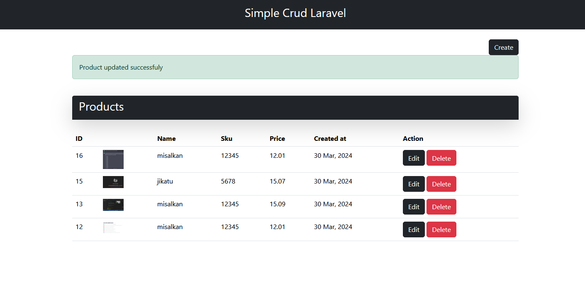

# Very Basic CRUD Product Laravel Project




## Overview

This guide will walk you through the steps to set up and run the CRUD (Create, Read, Update, Delete) product management system built with Laravel and MySQL.

### Prerequisites

- Composer installed on your system
- PHP installed on your system
- MySQL database server installed and running

## How to Run this Repo?

1. Clone the project repository from GitHub to your local machine:

   ```bash
   git clone <repository-url>
   ```

2. Change the directory:
    ```bash
    cd <example-app>
    ```

3. Install project dependencies using Composer:
    ```bash
    composer install
    ```
4. Rename the .env.example file to .env:
    ```bash
    cp .env.example .env
    ```
5. Open the .env file and configure your MySQL database     connection by updating the following lines with your database credentials:

    ```bash
    DB_CONNECTION=mysql
    DB_HOST=127.0.0.1
    DB_PORT=3306
    DB_DATABASE=your_database_name
    DB_USERNAME=your_database_username
    DB_PASSWORD=your_database_password
    ```
6. Run the database migrations to create the necessary tables:
    ```bash
    php artisan migrate
    ```
7. Start the Laravel development server:
    ```bash
    php artisan serve
    ```
